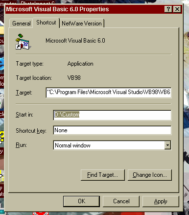

<div align="center">

## Change Default Project Location


</div>

### Description

Have VB installed in default location of C:\Program Files........ and have the "Save As" and "Existing Files" dialogs default to a customized location.
 
### More Info
 


<span>             |<span>
---                |---
**Submitted On**   |
**By**             |[TonyK](https://github.com/Planet-Source-Code/PSCIndex/blob/master/ByAuthor/tonyk.md)
**Level**          |Beginner
**User Rating**    |4.9 (44 globes from 9 users)
**Compatibility**  |VB 3\.0, VB 4\.0 \(16\-bit\), VB 4\.0 \(32\-bit\), VB 5\.0, VB 6\.0
**Category**       |[Miscellaneous](https://github.com/Planet-Source-Code/PSCIndex/blob/master/ByCategory/miscellaneous__1-1.md)
**World**          |[Visual Basic](https://github.com/Planet-Source-Code/PSCIndex/blob/master/ByWorld/visual-basic.md)
**Archive File**   |[](https://github.com/Planet-Source-Code/tonyk-change-default-project-location__1-29978/archive/master.zip)


### Source Code

```
I had submitted this question to the "Ask a Pro" section here as well as to the VB section of "AskMe.com" with no success so I contacted Microsoft who provided this all to simple solution.
I have installed VB into the default location but I keep all of my projects on a seperate drive. I was tired of having to change locations everytime I saved a project or opened a project. Any way here is the solution in case any of you are interested and do not already know.
Simply chage the "Start In" location of the shortcut to VB to the drive and/or folder that contains your projects. See the screen shot.
```

